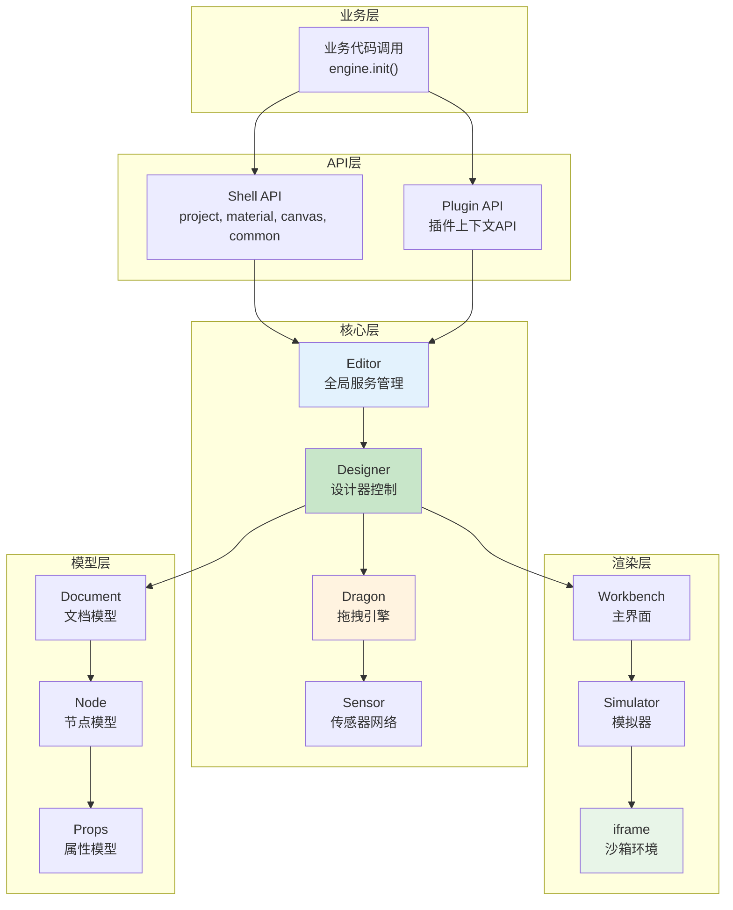

# Dragon分析总结与技术问题解答

## 🎯 综合分析总结

基于对`packages/designer/src/designer/dragon.ts`文件的深度分析，我已经完成了13个技术问题的详细解答。以下是核心发现和建议的汇总。

## 📋 主要技术发现

### **1. RGL系统 (问题1、5、6)**

#### **核心发现**
- RGL是**自实现的网格布局系统**，非第三方库
- `rgl.sleeping`事件控制RGL系统的激活/休眠状态
- `rgl.add.placeholder`和`rgl.remove.placeholder`控制拖拽占位符
- RGL占位符由监听这些事件的组件动态渲染

#### **文件位置**
- 定义：`packages/designer/src/document/node/node.ts:1222-1237`
- 使用：`packages/designer/src/designer/dragon.ts`
- 交互：`packages/designer/src/builtin-simulator/host.ts`

### **2. Designer核心架构 (问题2)**

#### **核心发现**
- Designer是**设计器控制中心**，与Editor构成双核心架构
- 管理拖拽、检测、项目、组件元数据等核心功能
- 通过事件总线实现与其他模块的解耦通信

#### **核心能力**
- 🎮 **交互管理**：Dragon拖拽、ActiveTracker追踪、Detecting检测
- 📋 **项目管理**：多文档、历史记录、选择管理
- 🧩 **组件管理**：元数据管理、增量加载、属性转换
- 🎨 **视图控制**：模拟器管理、渲染控制

### **3. 事件系统架构 (问题3、10)**

#### **多层事件体系**
1. **Editor全局事件总线**：跨模块通信
2. **Dragon拖拽事件系统**：拖拽专用事件
3. **Designer设计器事件**：设计态专用事件
4. **Document文档事件**：文档级状态变化
5. **组件内部事件**：组件级交互事件

#### **事件监听方法**
```typescript
// 监听特定事件的所有监听者
const designer = editor.get('designer');
console.log('drag事件监听者:', designer.dragon.emitter.listenerCount('drag'));
console.log('rgl.add.placeholder事件监听者:', designer.dragon.emitter.listenerCount('rgl.add.placeholder'));
```

### **4. Sensor传感器系统 (问题4)**

#### **传感器本质**
- **拖拽感应器**：负责特定区域的拖拽检测和处理
- **区域管理**：每个传感器管理特定的UI区域
- **智能协调**：Dragon引擎智能选择最合适的传感器

#### **主要传感器**
- **BuiltinSimulatorHost**：画布主传感器
- **OutlinePanelSensor**：大纲树传感器
- **自定义传感器**：业务扩展传感器

### **5. 拖拽流程分支 (问题7)**

#### **分支策略**
- **RGL分支**：网格布局特殊处理，早退出机制
- **普通分支**：常规拖拽处理，完整流程

#### **关键差异**
- RGL：占位符管理、pointer-events控制、状态清理
- 普通：传感器链处理、状态保持、连续执行

### **6. 数据结构问题 (问题11)**

#### **DragObject类型差异**
- **NodeData**：`{type: 'nodedata', data: componentMeta}` - 无nodes属性
- **Node**：`{type: 'node', nodes: [nodeInstance]}` - 有nodes属性

#### **解决方案**
```typescript
// 推荐修改：增加newBie检查
if (isRGL && !newBie) {  // 只有已存在组件才进入RGL处理
    // RGL特殊处理逻辑
}
```

### **7. 事件模式分析 (问题12)**

#### **核心发现**
- 低代码引擎主要使用**鼠标事件模拟拖拽**
- `isDragEvent`返回`false`是**正常现象**
- 鼠标模拟提供更好的自定义能力和iframe支持

## 🚀 完整技术架构图

### **低代码引擎核心架构**


## 🎛️ 问题解答配置建议

### **调试配置**
```typescript
// 在业务代码中添加全面的调试支持
window.lowcodeDebug = {
    // RGL调试
    enableRGLDebug: () => {
        const designer = editor.get('designer');
        designer.dragon.emitter.on('rgl.sleeping', (sleeping) => {
            console.log('🔥 RGL状态:', sleeping ? '休眠' : '激活');
        });

        designer.dragon.emitter.on('rgl.add.placeholder', (data) => {
            console.log('🟦 RGL占位符显示:', data);
        });
    },

    // 拖拽调试
    enableDragDebug: () => {
        const designer = editor.get('designer');
        designer.dragon.onDrag((e) => {
            console.log('🐉 拖拽事件:', {
                type: e.dragObject?.type,
                hasNodes: !!(e.dragObject as any)?.nodes,
                isRGL: !!e.isRGL,
                sensor: e.sensor?.constructor.name
            });
        });
    },

    // 事件监听者统计
    getEventStats: () => {
        const designer = editor.get('designer');
        const events = ['drag', 'dragstart', 'dragend', 'rgl.add.placeholder'];

        events.forEach(event => {
            console.log(`事件"${event}"监听者数量:`, designer.dragon.emitter.listenerCount(event));
        });
    }
};

// 启用所有调试
lowcodeDebug.enableRGLDebug();
lowcodeDebug.enableDragDebug();
lowcodeDebug.getEventStats();
```

## 🔧 性能优化建议

### **基于分析的优化建议**
```typescript
const performanceOptimizations = {
    // 1. 事件频率控制
    dragEventThrottling: {
        recommendation: "对drag事件进行16ms节流",
        implementation: "throttle(handler, 16)"
    },

    // 2. 传感器优化
    sensorOptimization: {
        recommendation: "动态禁用不需要的传感器",
        implementation: "sensor._sensorAvailable = false"
    },

    // 3. RGL优化
    rglOptimization: {
        recommendation: "缓存RGL状态检测结果",
        implementation: "getRGL结果缓存"
    },

    // 4. 内存管理
    memoryManagement: {
        recommendation: "及时清理事件监听器",
        implementation: "组件卸载时调用dispose方法"
    }
};
```

## 📈 扩展开发指南

### **自定义拖拽行为**
```typescript
// 扩展拖拽功能的标准模式
class CustomDragExtension {
    constructor(designer: Designer) {
        this.setupCustomDragBehavior(designer);
        this.setupCustomSensor(designer);
        this.setupCustomEvents(designer);
    }

    setupCustomDragBehavior(designer: Designer) {
        // 自定义拖拽逻辑
        designer.dragon.onDrag((e) => {
            if (this.shouldApplyCustomLogic(e)) {
                this.applyCustomDragLogic(e);
            }
        });
    }

    setupCustomSensor(designer: Designer) {
        // 注册自定义传感器
        const customSensor = new MyCustomSensor();
        designer.dragon.addSensor(customSensor);
    }
}
```

### **事件监听最佳实践**
```typescript
// 事件监听的标准模式
class EventListenerManager {
    private disposers: Array<() => void> = [];

    addListener(emitter: any, event: string, handler: Function) {
        const dispose = emitter.on(event, handler);
        this.disposers.push(dispose);
        return dispose;
    }

    // 统一清理
    cleanup() {
        this.disposers.forEach(dispose => dispose());
        this.disposers = [];
    }
}
```

## 🎯 最终建议

### **针对用户的Tab组件问题**
1. **使用JSSlot方案**：推荐使用JSSlot而非isContainer
2. **增加容器能力**：同时设置`isContainer: true`作为兜底
3. **优化DOM标识**：增加`data-tab-index`等标识帮助拖拽识别

### **针对拖拽异常问题**
1. **修复nodes访问**：在RGL判断中增加`!newBie`条件
2. **增强错误处理**：增加防御性检查和错误恢复
3. **完善调试**：使用提供的调试工具进行问题排查

### **针对引擎理解问题**
1. **分层学习**：按照API → Core → Implementation的顺序学习
2. **实践验证**：通过实际项目验证理论理解
3. **调试分析**：使用事件监听和状态检查深入理解

## 📚 相关文档索引

已创建的分析文档：
1. `031-RGL系统深度分析.md` - RGL系统详解
2. `032-Designer核心类深度解析.md` - Designer架构分析
3. `033-Dragon拖拽事件系统详解.md` - 拖拽事件系统
4. `034-Sensor传感器架构详解.md` - 传感器机制
5. `035-RGL占位符事件机制分析.md` - 占位符事件
6. `036-拖拽流程分支对比分析.md` - 拖拽分支流程
7. `037-DragObject数据结构与Nodes属性分析.md` - 数据结构问题
8. `038-isDragEvent为false原因分析.md` - 事件模式分析
9. `039-低代码引擎事件系统完整指南.md` - 完整事件系统
10. `040-完整iframe渲染流程图.md` - 渲染流程图
11. `041-工作空间模式与API模型综合分析.md` - 模式和API

## 🎯 学习路径建议

### **初级阶段**
1. 阅读API文档，了解基础概念
2. 学习iframe渲染流程，理解整体架构
3. 实践简单的组件拖拽功能

### **中级阶段**
1. 深入了解Designer和Dragon的协作
2. 学习事件系统和传感器机制
3. 理解RGL系统的特殊处理

### **高级阶段**
1. 掌握两种工作空间模式的差异
2. 能够扩展自定义传感器和拖拽行为
3. 深度定制引擎功能和性能优化

**通过以上分析，你现在应该对低代码引擎的核心机制有了全面而深入的理解。这些知识将帮助你更好地使用和扩展低代码引擎的功能。**
