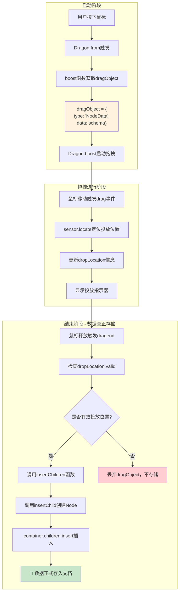
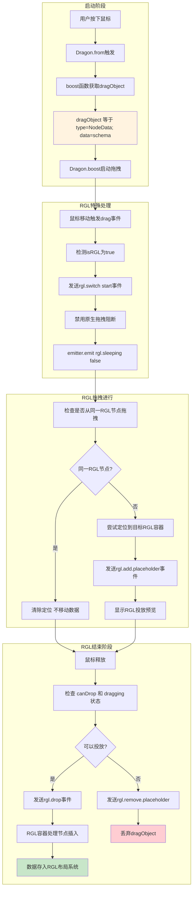

# 043-组件库拖拽数据流完整分析

## 概述

基于 `engine-core.js` 源码分析，从组件库面板拖入新组件的数据流处理过程，分为 **RGL 组件** 和 **普通组件** 两种情况，具有不同的处理逻辑和数据存储时机。

## 核心发现

### 📊 数据存储时机

- **组件数据并非在鼠标按下时立即存储**
- **数据在拖拽结束（dragend）时才真正插入到文档中**
- **拖拽开始和进行中只是预览和定位阶段**

### 🔄 处理差异

- **RGL 组件**：采用原生拖拽机制 + 特殊事件处理
- **普通组件**：采用传统 sensor 定位 + dropLocation 机制

---

## 1. 拖拽启动阶段 - Dragon.from 方法

### 1.1 组件库面板绑定

```typescript
// engine-core.js 行 37746-37764
Dragon.prototype.from = function(shell, boost) {
    var mousedown = function mousedown(e) {
        // 1. 过滤右键和ESC键
        if (e.which === 3 || e.button === 2) {
            return;
        }

        // 2. 通过boost函数获取拖拽对象
        var dragObject = boost(e);  // ⚡ 关键：从组件库获取组件数据
        if (!dragObject) {
            return;
        }

        // 3. 启动拖拽流程
        _this.boost(dragObject, e);
    };

    // 绑定到组件库面板
    shell.addEventListener('mousedown', mousedown);
    return function() {
        shell.removeEventListener('mousedown', mousedown);
    };
};
```

### 1.2 boost函数获取dragObject

```typescript
// 组件库面板的boost函数通常返回：
// 新组件拖拽对象（NodeData类型）
const dragObject = {
    type: 'NodeData',              // 标识为新组件数据
    data: {                        // 组件Schema数据
        componentName: 'Button',
        props: { ... },
        children: [ ... ]
    }
};
```

**⚠️ 重要：此时数据仅存在于内存中的dragObject，尚未插入文档**

---

## 2. 普通组件拖拽数据流

### 2.1 流程图



### 2.2 关键代码流程

#### 2.2.1 拖拽开始（dragstart）

```typescript
// engine-core.js 行 37773+
Dragon.prototype.boost = function(dragObject, boostEvent) {
    // 1. 设置拖拽状态，但不存储数据
    this.setDraggingState(true);

    // 2. 创建定位事件
    var locateEvent = createLocateEvent(boostEvent);

    // 3. 触发拖拽开始事件
    this.emitter.emit('dragstart', locateEvent);

    // ⚡ 此时dragObject仅在内存中，未存储到文档
};
```

#### 2.2.2 拖拽进行中（drag）

```typescript
// 普通组件的拖拽处理（非RGL）
var drag = function drag(e) {
    var locateEvent = createLocateEvent(e);
    var sensor = chooseSensor(locateEvent);

    if (sensor) {
        // 定位投放位置，但不实际插入数据
        sensor.locate(locateEvent);
        // 显示投放指示器
    } else {
        designer.clearLocation();
    }

    // 发送拖拽进行事件
    _this.emitter.emit('drag', locateEvent);
};
```

#### 2.2.3 拖拽结束（dragend）- 数据真正存储

```typescript
// engine-core.js 行 40430-40468
this.dragon.onDragend(function (e) {
    var dragObject = e.dragObject;
    var loc = _this._dropLocation;  // 投放位置信息

    if (loc && isLocationChildrenDetail(loc.detail) && loc.detail.valid !== false) {
        var nodes;

        if (isDragNodeDataObject(dragObject)) {
            // 📝 关键：处理新组件数据（从组件库拖入）
            var nodeData = Array.isArray(dragObject.data) ? dragObject.data : [dragObject.data];

            // 验证是否为有效的NodeSchema
            var isNotNodeSchema = nodeData.find(item => !isNodeSchema(item));
            if (isNotNodeSchema) {
                return; // 数据无效，不存储
            }

            // ⚡ 真正的数据插入发生在这里
            nodes = insertChildren(loc.target, nodeData, loc.detail.index);
        }

        if (nodes) {
            // 选中新插入的节点
            loc.document.selection.selectAll(nodes.map(o => o.id));
            // 追踪第一个节点
            setTimeout(() => _this.activeTracker.track(nodes[0]), 10);
        }
    }
    // 如果没有有效的投放位置，dragObject被丢弃，数据不存储
});
```

#### 2.2.4 数据插入核心函数

```typescript
// engine-core.js 行 30646-30677
function insertChild(container, thing, at, copy) {
    var node;

    if (isNodeSchema(thing)) {
        // 从Schema创建真正的Node对象
        node = container.document.createNode(thing);
    }

    if (isNode(node)) {
        // 插入到容器的children中
        container.children.insert(node, at);
        return node;
    }

    return null;
}

function insertChildren(container, nodes, at, copy) {
    var results = [];
    while (node = nodes.pop()) {
        // 逐个插入子节点
        node = insertChild(container, node, at);
        results.push(node);
    }
    return results;
}
```

---

## 3. RGL 组件拖拽数据流

### 3.1 RGL 组件识别

```typescript
// engine-core.js 行 30384-30394
Node.prototype.getRGL = function() {
    var isRGLContainerNode = this.isRGLContainer;
    var isRGLNode = this.getParent()?.isRGLContainer;
    var isRGL = isRGLContainerNode || (isRGLNode && (!isContainerNode || !isEmptyNode));
    var rglNode = isRGLContainerNode ? this : (isRGL ? this.getParent() : null);

    return {
        isRGL,
        rglNode,
        // ...
    };
};
```

### 3.2 RGL 流程图



### 3.3 RGL 特殊处理代码

#### 3.3.1 RGL 拖拽开始识别

```typescript
// engine-core.js 行 34687-34698
var rglNode = node?.getParent();
var isRGLNode = rglNode?.isRGLContainer;

if (isRGLNode) {
    // 跳过resize handle
    if (downEvent.target.classList.contains('react-resizable-handle')) return;

    // 禁止多选
    isMulti = false;

    // 发送RGL切换开始事件
    designer.dragon.emitter.emit('rgl.switch', {
        action: 'start',
        rglNode: rglNode
    });
}
```

#### 3.3.2 RGL 拖拽进行中处理

```typescript
// engine-core.js 行 37845-37884
var {isRGL, rglNode} = getRGL(e);

if (isRGL) {
    // 启用RGL拖拽模式
    this.emitter.emit('rgl.sleeping', false);

    // 检查是否从同一RGL节点内拖拽
    if (fromRglNode && fromRglNode.id === rglNode.id) {
        console.log('是从同一个RGL节点内拖拽');
        designer.clearLocation();
        this.clearState();
        this.emitter.emit('drag', locateEvent);
        return;
    }

    // 尝试在目标位置定位
    this._canDrop = !!(sensor?.locate(locateEvent));
    if (this._canDrop) {
        console.log('尝试在目标位置进行定位，判断可以放置');

        // 发送添加占位符事件
        this.emitter.emit('rgl.add.placeholder', {
            rglNode: rglNode,
            fromRglNode: fromRglNode,
            node: locateEvent.dragObject?.nodes[0],
            event: e
        });

        designer.clearLocation();
        this.clearState();
        this.emitter.emit('drag', locateEvent);
        return;
    }
}
```

#### 3.3.3 RGL 拖拽结束处理

```typescript
// engine-core.js 行 37957-37977
var {isRGL, rglNode} = getRGL(e);

if (isRGL && this._canDrop && this._dragging) {
    var tarNode = dragObject && dragObject.nodes?.[0];

    if (tarNode && rglNode.id !== tarNode.id) {
        // 避免死循环
        this.emitter.emit('rgl.drop', {
            rglNode: rglNode,
            node: tarNode
        });

        // 选中投放的节点
        var selection = designer.project.currentDocument?.selection;
        selection?.select(tarNode.id);
    }
}

// 移除RGL占位符
this.emitter.emit('rgl.remove.placeholder');
```

---

## 4. 关键差异对比

### 4.1 数据存储时机对比

| 阶段                | 普通组件           | RGL组件                   | 数据状态               |
| ------------------- | ------------------ | ------------------------- | ---------------------- |
| **mousedown** | 创建dragObject     | 创建dragObject            | 内存中，未存储         |
| **dragstart** | 设置拖拽状态       | 设置拖拽状态 + rgl.switch | 内存中，未存储         |
| **drag**      | sensor定位         | RGL特殊定位逻辑           | 内存中，未存储         |
| **dragend**   | insertChildren存储 | rgl.drop事件存储          | **真正存入文档** |

### 4.2 处理机制对比

| 特性               | 普通组件               | RGL组件          |
| ------------------ | ---------------------- | ---------------- |
| **定位方式** | sensor.locate()        | RGL容器定位      |
| **投放预览** | 标准dropLocation指示器 | rgl.placeholder  |
| **数据插入** | insertChildren直接插入 | rgl.drop事件处理 |
| **事件系统** | 标准drag事件           | RGL专用事件      |

### 4.3 错误处理差异

```typescript
// 普通组件：无效投放位置直接丢弃
if (!loc || !loc.detail.valid) {
    // dragObject被丢弃，数据不存储
    return;
}

// RGL组件：canDrop检查
if (!this._canDrop || !this._dragging) {
    // 发送移除占位符事件，数据不存储
    this.emitter.emit('rgl.remove.placeholder');
    return;
}
```

---

## 5. 数据流总结

### 5.1 核心原则

1. **延迟存储**：数据始终在dragend阶段才真正存入文档
2. **状态驱动**：通过_dragging、_canDrop等状态控制流程
3. **事件驱动**：普通组件用标准事件，RGL用专用事件系统

### 5.2 性能优化点

- **内存暂存**：拖拽过程中数据仅在内存中，避免频繁DOM操作
- **预检验证**：dragend时验证投放位置有效性，无效则直接丢弃
- **状态缓存**：通过状态标记避免重复计算

### 5.3 业务影响

- **撤销重做**：由于数据在dragend时才存储，撤销重做逻辑更清晰
- **性能表现**：延迟存储避免了拖拽过程中的性能抖动
- **用户体验**：RGL组件的特殊处理提供了更流畅的网格布局体验

---

## 6. 调试建议

### 6.1 关键调试点

```typescript
// 1. 检查dragObject创建
console.log('dragObject created:', dragObject);

// 2. 检查拖拽状态
console.log('dragging state:', dragon.dragging);

// 3. 检查投放位置
console.log('drop location:', dropLocation);

// 4. 检查数据插入
console.log('nodes inserted:', nodes);
```

### 6.2 常见问题排查

- **数据未存储**：检查dropLocation.valid和loc.detail.valid
- **RGL投放失败**：检查_canDrop状态和rgl.drop事件
- **性能问题**：关注dragend阶段的insertChildren性能

这套数据流设计确保了拖拽操作的性能和可靠性，同时为不同类型的组件提供了针对性的处理策略。
