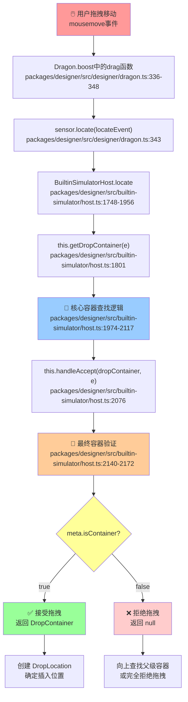

# 🎯 拖拽容器判断核心代码详解

## 📋 概述

本文档详细分析了低代码引擎中判断「拖入容器」还是「拖入画布」的完整代码流程，通过逐行注释的方式帮助理解相关原理。

## 🔗 调用链路图



## 📂 关键文件和代码位置

### 1. 拖拽引擎触发点

**文件**: `packages/designer/src/designer/dragon.ts`
**方法**: `boost` 方法中的 `drag` 函数
**关键代码**: 第336-348行

```typescript
// 🎯 常规的传感器定位逻辑（核心容器判断入口）
if (sensor) {
    sensor.fixEvent(locateEvent); // 让传感器修正事件对象（如坐标转换）

    // 🔥 关键调用：这里触发容器判断逻辑！
    // sensor.locate() 会调用 BuiltinSimulatorHost.locate()
    // 最终调用 getDropContainer() 和 handleAccept() 来判断容器
    sensor.locate(locateEvent); // 执行定位，更新位置信息和视觉反馈
} else {
    designer.clearLocation(); // 没有传感器时清除位置信息
}
```

### 2. 传感器定位处理

**文件**: `packages/designer/src/builtin-simulator/host.ts`
**方法**: `locate`
**关键代码**: 第1748-1956行

**核心职责**:

- 验证拖拽对象是否可移动
- 查找合适的投放容器
- 计算精确的插入位置
- 创建并返回位置数据对象

**关键步骤**:

1. 过滤可操作节点（检查移动权限）
2. 激活传感器和滚动处理
3. **调用 `getDropContainer(e)` 查找投放容器**
4. 检查容器是否被锁定
5. 计算插入位置和视觉反馈

### 3. 容器查找核心逻辑

**文件**: `packages/designer/src/builtin-simulator/host.ts`
**方法**: `getDropContainer`
**关键代码**: 第1974-2117行

**🔥 这是判断「拖入容器」还是「拖入画布」的关键方法！**

**核心流程**:

#### 步骤1: DOM元素到节点映射

```typescript
// 🔑 关键调用：从DOM元素查找对应的低代码节点
const ref = this.getNodeInstanceFromElement(target); // DOM→节点映射的核心方法

if (ref?.node) {
    // ✅ 成功映射：找到了对应的节点
    container = ref.node; // 将找到的节点作为候选容器
} else {
    // 🏠 兜底策略：映射失败时使用根节点作为容器
    container = currentRoot; // 将拖拽目标设为根节点（整个画布）
}
```

#### 步骤2: 容器类型检查

```typescript
if (!container?.isParental()) {
    // 🔍 如果当前节点不是容器类型，向上查找父级容器
    // isParental() 检查节点是否可以包含子节点
    container = container?.parent || currentRoot; // 使用父节点或根节点作为容器
}
```

#### 步骤3: 防止循环拖拽

```typescript
if (isDragNodeObject(dragObject)) {
    const { nodes } = dragObject;
    // 遍历检查被拖拽的节点，防止拖拽到自己内部
    while (i-- > 0) {
        if (contains(nodes[i], p)) {
            // 🚫 发现循环：容器包含在被拖拽的节点内
            p = nodes[i].parent; // 向上移动到安全位置
        }
    }
}
```

#### 步骤4: 容器验证循环

```typescript
while (container) {
    // 🎯 关键验证：检查容器是否可以接受拖拽
    res = this.handleAccept(dropContainer, e); // 🔥 调用容器接受验证方法

    if (res === true) {
        // ✅ 容器接受验证通过
        return dropContainer; // 返回找到的有效容器
    }

    // ❌ 当前容器不接受拖拽，尝试向上查找父级容器
    container = container.parent; // 移动到父级节点
}
```

### 4. 容器接受验证

**文件**: `packages/designer/src/builtin-simulator/host.ts`
**方法**: `handleAccept`
**关键代码**: 第2140-2172行

**🎯 这里是最终决定容器是否接受拖拽的关键验证！**

#### 核心判断逻辑

```typescript
// 🎯 核心判断：检查是否为容器组件
if (!meta.isContainer && !acceptable) {
    // ❌ 关键检查：如果组件的 meta.isContainer 为 false 且不被自定义逻辑接受
    // 这就是为什么 JSSlot 拖拽失败的原因！JSSlot 组件通常 meta.isContainer = false
    return false; // 拒绝拖拽，返回 false
}
```

#### 验证步骤

1. **根节点特殊处理**: 根节点使用文档级嵌套检查
2. **获取组件元数据**: 读取 `meta.isContainer` 标志
3. **自定义接受检查**: 通过 `isAcceptable` 方法扩展
4. **🔥 核心容器检查**: `meta.isContainer` 必须为 `true`
5. **嵌套兼容性检查**: 检查父子组件兼容性

## 🔍 JSSlot vs isContainer 的技术差异

### JSSlot 拖拽失败的根本原因

#### 1. DOM映射问题

```typescript
// JSSlot 渲染时直接递归，没有包装节点
if (isJSSlot(schema)) {
    return this.__createVirtualDom(schema.value, scope, parentInfo);
}

// 结果：getNodeInstanceFromElement(target) 找不到对应的JSSlot节点
// 只能映射到包含JSSlot的父组件
```

#### 2. 容器标志问题

```typescript
// JSSlot 组件的 meta 配置通常是：
{
    componentName: 'TabPane',
    isContainer: false,  // ❌ 关键问题：不是容器
    // ...
}

// handleAccept 检查时：
if (!meta.isContainer && !acceptable) {
    return false; // ❌ 直接拒绝拖拽
}
```

#### 3. 插入逻辑不匹配

```typescript
// 标准容器插入：
container.insertChildren(nodes, index); // ✅ 修改 children 数组

// JSSlot 实际需要：
container.getProp('slotName').setValue(newValue); // ❌ 需要修改属性
```

### isContainer 拖拽成功的原因

#### 1. DOM映射清晰

```typescript
// isContainer 组件有明确的DOM节点
<div data-node-id="container123" className="my-container">
    {children}
</div>

// getNodeInstanceFromElement 可以准确映射到容器节点
```

#### 2. 容器标志正确

```typescript
// isContainer 组件的 meta 配置：
{
    componentName: 'MyContainer',
    isContainer: true,  // ✅ 明确标识为容器
    // ...
}
```

#### 3. 插入逻辑标准

```typescript
// 使用标准的 children 插入逻辑
if (res === true) {
    return dropContainer; // ✅ 返回有效容器
}
```

## 📊 调试技巧

### 1. DOM元素追踪

```typescript
// 在 getDropContainer 中添加调试
console.log('🎯 拖拽目标信息:', {
    target: e.target,
    className: e.target.className,
    dataset: e.target.dataset,
    tagName: e.target.tagName
});
```

### 2. 节点映射调试

```typescript
// 在 getNodeInstanceFromElement 后添加调试
const ref = this.getNodeInstanceFromElement(target);
console.log('🔗 节点映射结果:', {
    success: !!ref?.node,
    nodeId: ref?.node?.id,
    componentName: ref?.node?.componentName,
    isParental: ref?.node?.isParental()
});
```

### 3. 容器验证调试

```typescript
// 在 handleAccept 中添加调试
console.log('🎯 容器验证信息:', {
    containerName: container.componentName,
    isContainer: meta.isContainer,
    acceptable: this.isAcceptable(container),
    isRoot: isRootNode(container),
    containsFocus: container.contains(focusNode)
});
```

### 4. 完整拖拽流程调试

```typescript
// 在 locate 方法开头添加
console.log('🚀 拖拽定位开始:', {
    dragObjectType: dragObject.type,
    hasNodes: !!dragObject.nodes,
    nodeCount: dragObject.nodes?.length || 0,
    targetElement: e.target?.tagName + '.' + e.target?.className
});
```

## 💡 关键要点总结

### 1. 核心判断位置

- **文件**: `packages/designer/src/builtin-simulator/host.ts`
- **关键行**: 第2161行 `if (!meta.isContainer && !acceptable)`

### 2. 判断逻辑

1. **DOM→节点映射**: `getNodeInstanceFromElement(target)`
2. **容器类型检查**: `container.isParental()`
3. **循环拖拽防护**: 检查 `contains(dragNode, container)`
4. **容器标志验证**: `meta.isContainer === true`
5. **嵌套规则检查**: `document.checkNesting(container, dragObject)`

### 3. 失败原因排查

- ❌ DOM元素无法映射到节点
- ❌ 节点不是 `isParental()` 类型
- ❌ `meta.isContainer` 为 `false`
- ❌ 自定义 `isAcceptable()` 返回 `false`
- ❌ 嵌套规则检查失败

### 4. 成功条件

- ✅ DOM元素成功映射到低代码节点
- ✅ 节点是 `isParental()` 类型或有父级容器
- ✅ `meta.isContainer` 为 `true` 或 `isAcceptable()` 为 `true`
- ✅ 通过嵌套规则检查

## 🎯 结论

通过深入分析代码可以看出，**`meta.isContainer` 标志是判断容器的关键因素**。这就是为什么：

- **isContainer 方案**: 设置 `meta.isContainer = true`，拖拽天然成功
- **JSSlot 方案**: 通常 `meta.isContainer = false`，需要复杂的自定义逻辑

理解这个核心判断逻辑，就能明白为什么推荐使用 `isContainer` 方案，以及如何解决 JSSlot 的拖拽问题！
