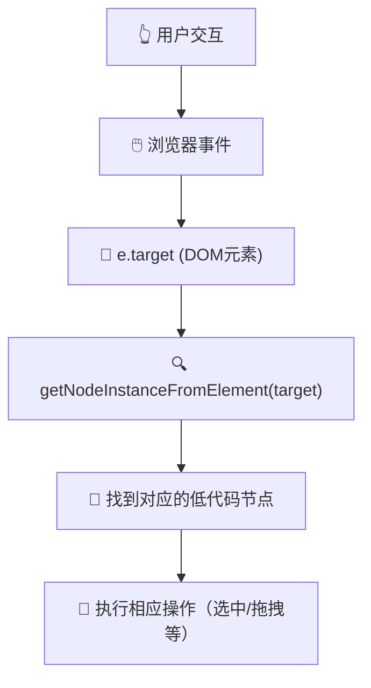
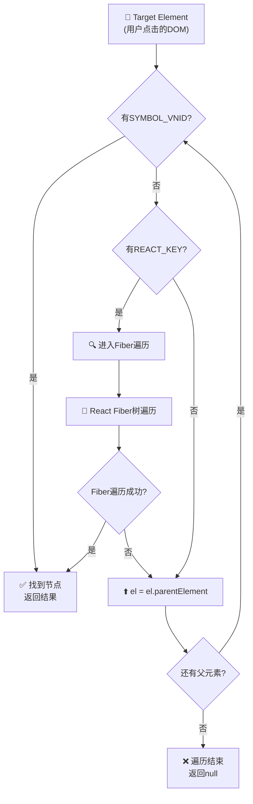
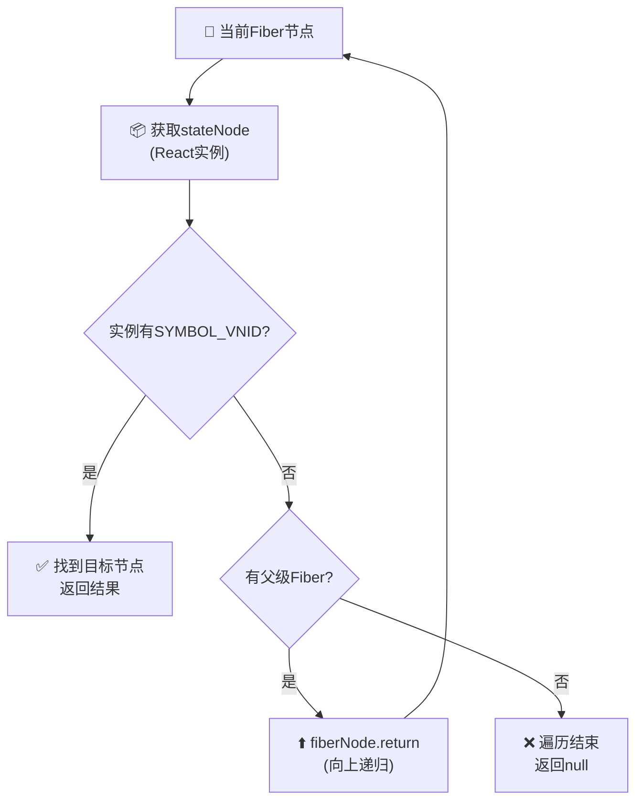
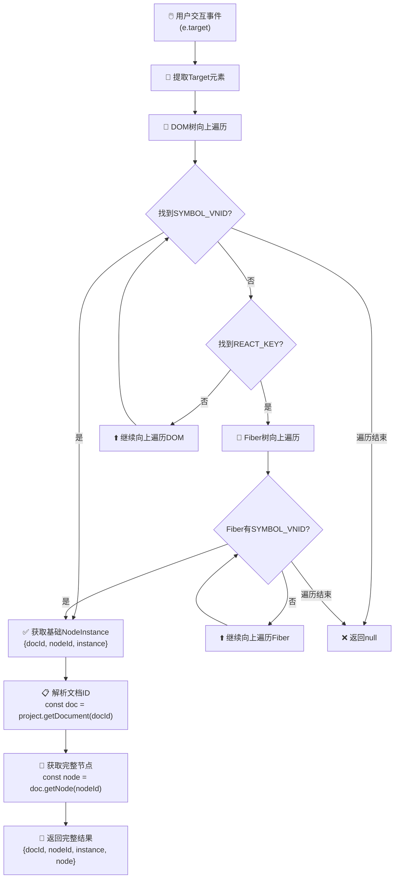
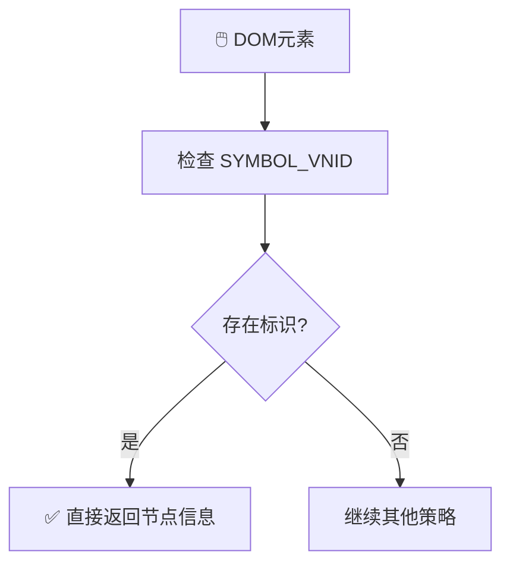
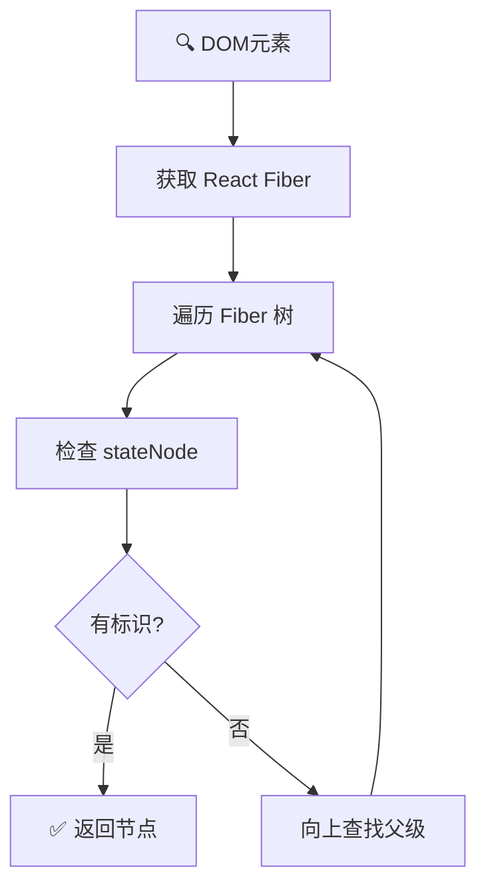
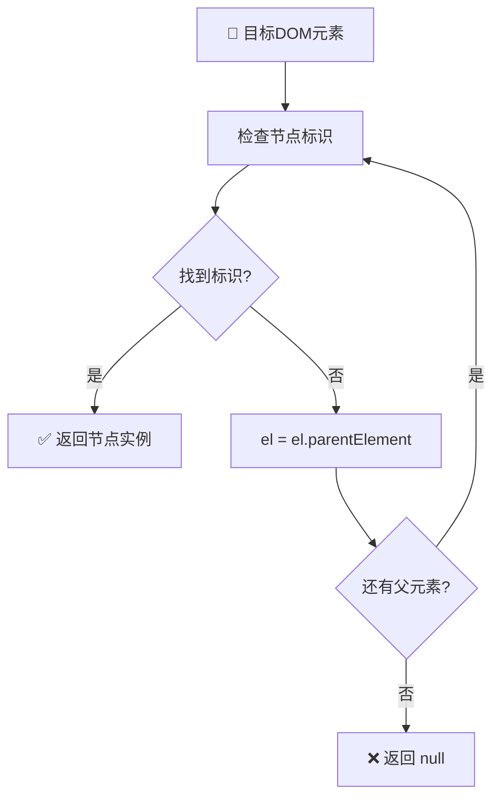

# getNodeInstanceFromElement 深度解析

## 🎯 函数概述

`getNodeInstanceFromElement` 是低代码引擎中一个**核心方法**，它的职责是**从DOM元素查找对应的低代码节点实例**。这是建立"可视化设计器界面"与"低代码数据模型"之间桥梁的关键函数。

## 📍 函数位置与调用链

### 主入口

```typescript
// packages/designer/src/builtin-simulator/host.ts:1602
getNodeInstanceFromElement(target: Element | null): IPublicTypeNodeInstance<IPublicTypeComponentInstance, INode> | null
```

### 调用链

```text
🖱️ 用户交互（拖拽/点击DOM元素）
    ↓
getDropContainer() → getNodeInstanceFromElement()
    ↓
BuiltinSimulatorHost.getClosestNodeInstance()
    ↓
SimulatorRendererContainer.getClosestNodeInstance()
    ↓
getClosestNodeInstance() [核心实现]
```

## 🔍 核心工作原理

### ⭐ Target参数详解

在深入分析查找过程之前，首先需要理解 `target` 参数的含义和来源：

#### Target是什么

```typescript
// target 本质上是浏览器DOM事件中的目标元素
const target: Element = e.target as Element;

// 常见的来源场景：
// 1. 拖拽事件：用户拖拽组件时鼠标悬停的DOM元素
const dragEvent: DragEvent = { target: someElement, ... };
const nodeInstance = getNodeInstanceFromElement(dragEvent.target as Element);

// 2. 点击事件：用户点击画布时的目标元素
const clickEvent: MouseEvent = { target: clickedElement, ... };
const nodeInstance = getNodeInstanceFromElement(clickEvent.target as Element);

// 3. 悬停事件：鼠标悬停时的目标元素
const hoverEvent: MouseEvent = { target: hoveredElement, ... };
const nodeInstance = getNodeInstanceFromElement(hoverEvent.target as Element);
```

#### ⚠️ 重要澄清：JSSlot vs Slot

你的debug发现揭示了一个关键技术细节：

##### JSSlot（Schema属性） ≠ Slot（实际组件节点）

```typescript
// 1. JSSlot 是 Schema 中的属性值（不是组件）
const tabSchema = {
  componentName: 'Tab',
  props: {
    children: {
      type: 'JSSlot',        // 🔍 这是属性值类型
      value: [/* 子组件 */]   // 插槽内容
    }
  }
};

// 2. 当 JSSlot 有内容时，引擎会创建真实的 Slot 节点
// packages/designer/src/document/node/props/prop.ts:431
setAsSlot(data: IPublicTypeJSSlot) {
  const slotSchema = {
    componentName: 'Slot',   // 🔥 创建真实的 Slot 组件节点
    children: data.value,    // JSSlot 的内容变成 Slot 的子节点
  };

  // 创建实际的低代码节点实例
  this._slotNode = owner.document?.createNode<ISlotNode>(slotSchema);
}

// 3. Slot 是真实的 React 组件（packages/react-simulator-renderer/src/builtin-components/slot.tsx）
class Slot extends Component {
  static componentMetadata = {
    componentName: 'Slot',
    configure: {
      component: {
        isContainer: true,     // 🔥 关键：Slot 是容器组件
      }
    }
  };

  render() {
    return <>{this.props.children}</>;  // 渲染插槽内容
  }
}
```

**DOM遍历中的Slot节点**：

```typescript
// 当你debug看到 dropContainer?.container?.componentName === 'Slot' 时：
// 这是因为 Slot 确实是一个真实存在的DOM节点，具有：
// - 真实的React组件实例
// - 挂载的DOM元素
// - Symbol标识符 (SYMBOL_VNID)
// - componentName: 'Slot'
// - isContainer: true

// JSSlot 处理流程：
// JSSlot属性 → setAsSlot() → 创建Slot节点 → 渲染Slot组件 → 生成DOM元素
//                                    ↓
//                        可被 getNodeInstanceFromElement 找到
```

#### Target的特征

- ✅ **真实DOM元素**: target是浏览器渲染的实际DOM节点
- ✅ **用户交互点**: 代表用户鼠标/触摸交互的精确位置
- ✅ **可能是任何层级**: 可能是叶子节点、容器节点或中间节点
- ✅ **包含React内部信息**: 包含React Fiber引用和组件实例数据

#### Target在系统中的流转



### Step 1 入口处理

```typescript
getNodeInstanceFromElement(target: Element | null): IPublicTypeNodeInstance<IPublicTypeComponentInstance, INode> | null {
  if (!target) {
    return null;
  }

  // 🔑 关键：委托给 getClosestNodeInstance 进行具体查找
  const nodeInstance = this.getClosestNodeInstance(target);
  if (!nodeInstance) {
    return null;
  }

  // 📋 组装完整的节点实例信息
  const { docId } = nodeInstance;
  const doc = this.project.getDocument(docId)!;
  const node = doc.getNode(nodeInstance.nodeId);

  return {
    ...nodeInstance,
    node,  // 🔥 关键：附加完整的节点对象
  };
}
```

### Step 2 渲染器委托

```typescript
// packages/designer/src/builtin-simulator/host.ts:1496
getClosestNodeInstance(from: IPublicTypeComponentInstance, specId?: string): IPublicTypeNodeInstance<IPublicTypeComponentInstance> | null {
  // 🎯 委托给具体的渲染器实现
  return this.renderer?.getClosestNodeInstance(from, specId) || null;
}
```

### Step 3 核心查找算法

```typescript
// packages/react-simulator-renderer/src/renderer.ts:614
function getClosestNodeInstance(from: ReactInstance, specId?: string): IPublicTypeNodeInstance<ReactInstance> | null {
  let el: any = from;

  if (el) {
    if (isElement(el)) {
      // 🔧 情况1：DOM元素 → 需要缓存React内部键
      el = cacheReactKey(el);
    } else {
      // 🔧 情况2：React实例 → 直接通过Fiber查找
      return getNodeInstance(getReactInternalFiber(el), specId);
    }
  }

  // 🔄 核心循环：向上遍历DOM树
  while (el) {
    // 🎯 方式1：检查元素上是否有节点标识符
    if (SYMBOL_VNID in el) {
      const nodeId = el[SYMBOL_VNID];
      const docId = el[SYMBOL_VDID];
      if (!specId || specId === nodeId) {
        return {
          docId,
          nodeId,
          instance: el,
        };
      }
    }

    // 🎯 方式2：通过React Fiber查找
    if (el[REACT_KEY]) {
      return getNodeInstance(el[REACT_KEY], specId);
    }

    // ⬆️ 向上查找父元素
    el = el.parentElement;
  }

  return null;
}
```

## 🔄 详细遍历机制解析

系统中存在**两个层次的遍历**，它们协同工作来确保能找到正确的低代码节点：

### 🌳 遍历1：DOM树向上遍历

#### DOM遍历目标

- 从用户交互的target元素开始，沿DOM树向上查找带有节点标识的元素

#### DOM遍历条件

```typescript
while (el) {  // 只要当前元素存在就继续
  // 检查当前元素是否有标识
  if (SYMBOL_VNID in el) { /* 找到目标 */ }
  if (el[REACT_KEY]) { /* 尝试Fiber查找 */ }

  // 向上移动
  el = el.parentElement;  // 🔑 核心：向父元素移动
}
```

#### DOM遍历过程



#### DOM遍历结束条件

1. ✅ **成功退出**: 找到包含`SYMBOL_VNID`的元素
2. ✅ **成功退出**: 通过`REACT_KEY`进入Fiber遍历并找到节点
3. ❌ **失败退出**: `el.parentElement`为null（到达document根部）

### 🧬 遍历2：React Fiber树向上遍历

#### Fiber遍历目标

- 沿React组件树向上查找包含节点标识的React组件实例

#### Fiber遍历条件

```typescript
function getNodeInstance(fiberNode: any, specId?: string): IPublicTypeNodeInstance<ReactInstance> | null {
  const instance = fiberNode?.stateNode;  // 获取React实例

  // 检查实例是否有节点标识
  if (instance && SYMBOL_VNID in instance) {
    return { docId, nodeId, instance };  // 找到目标
  }

  // 向上遍历的条件和逻辑
  if (!instance && !fiberNode?.return) return null;  // 结束条件
  return getNodeInstance(fiberNode?.return, specId);  // 🔑 递归向上
}
```

#### Fiber遍历过程



#### Fiber遍历结束条件

1. ✅ **成功退出**: 找到包含`SYMBOL_VNID`的React实例
2. ❌ **失败退出**: `fiberNode.return`为null（到达Fiber树根部）

### 🔗 两种遍历的协调机制

#### 触发时机

```typescript
// DOM遍历过程中发现REACT_KEY时触发Fiber遍历
if (el[REACT_KEY]) {
  return getNodeInstance(el[REACT_KEY], specId);  // 🔄 切换到Fiber遍历
}
```

#### 优先级策略

1. **优先Symbol标识**: DOM元素直接包含标识时立即返回（性能最佳）
2. **备用Fiber遍历**: Symbol标识缺失时通过React Fiber查找
3. **逐级向上**: 两种遍历都会向上查找直到找到目标或到达边界

#### 遍历深度对比

| 遍历类型 | 平均深度 | 最大深度 | 性能特点 |
|---------|---------|---------|---------|
| DOM遍历 | 3-5层 | 15-20层 | 快速，直接内存访问 |
| Fiber遍历 | 2-4层 | 10-15层 | 较慢，需要解析Fiber结构 |

## 🎯 最终节点获取流程

在经过复杂的遍历过程后，系统如何最终组装完整的节点信息：

### 🔧 获取过程拆解

#### 阶段1：基础信息获取

```typescript
// 经过遍历后获得的基础NodeInstance
const nodeInstance = this.getClosestNodeInstance(target);
// 结果格式: { docId: string, nodeId: string, instance: ReactInstance }
```

#### 阶段2：文档实例解析

```typescript
const { docId } = nodeInstance;  // 提取文档ID
const doc = this.project.getDocument(docId)!;  // 🔑 获取完整的文档实例
```

#### 阶段3：完整节点组装

```typescript
const node = doc.getNode(nodeInstance.nodeId);  // 🔑 获取完整的低代码节点
return {
  ...nodeInstance,  // 保留基础信息(docId, nodeId, instance)
  node,             // 🔥 关键：附加完整的INode对象
};
```

### 🏗️ 完整流程图



### 📊 获取结果的数据结构

#### 成功返回的完整结构

```typescript
interface CompleteNodeInstance {
  docId: string;        // 文档ID - 定位到具体的设计文档
  nodeId: string;       // 节点ID - 低代码节点的唯一标识
  instance: ReactInstance;  // React实例 - 真实的DOM/组件实例
  node: INode;          // 🔥 完整节点对象 - 包含所有低代码属性和方法
}
```

#### Node对象包含的核心能力

```typescript
// node对象提供的关键API
node.select();              // 选中节点
node.hover(true);          // 悬停效果
node.remove();             // 删除节点
node.parent;               // 父节点引用
node.children;             // 子节点集合
node.componentName;        // 组件名称
node.props;                // 组件属性
node.componentMeta;        // 组件元数据
```

### ⚡ 关键优化点

#### 缓存机制

- `REACT_KEY`缓存：避免重复检测React版本差异
- 文档实例缓存：`project.getDocument()`有内部缓存

#### 早期退出策略

- Symbol标识优先：最快路径，O(1)查找
- 遍历边界检查：到达根节点时立即退出

#### 容错处理

- 空值检查：target、nodeInstance、doc、node的多层验证
- 类型安全：TypeScript严格类型检查防止运行时错误

## 🏗️ 节点标识机制

### Symbol标识符

```typescript
const SYMBOL_VNID = Symbol('_LCNodeId');   // 节点ID标识符
const SYMBOL_VDID = Symbol('_LCDocId');    // 文档ID标识符
```

### 标识符注入时机

```typescript
// packages/react-simulator-renderer/src/renderer.ts:133
mountInstance(id: string, instance: ReactInstance | null) {
  // 🔥 关键：在组件挂载时注入标识符
  (instance as any)[SYMBOL_VNID] = id;      // 注入节点ID
  (instance as any)[SYMBOL_VDID] = docId;   // 注入文档ID

  // 📝 建立双向映射关系
  // DOM实例 ↔ 低代码节点ID
}
```

## ⚙️ React Fiber 遍历机制

### Fiber 查找核心逻辑

```typescript
function getNodeInstance(fiberNode: any, specId?: string): IPublicTypeNodeInstance<ReactInstance> | null {
  const instance = fiberNode?.stateNode;  // 获取React实例

  // 🔍 检查实例是否有节点标识
  if (instance && SYMBOL_VNID in instance) {
    const nodeId = instance[SYMBOL_VNID];
    const docId = instance[SYMBOL_VDID];
    if (!specId || specId === nodeId) {
      return {
        docId,
        nodeId,
        instance,
      };
    }
  }

  // 🔄 递归向上查找父级Fiber节点
  if (!instance && !fiberNode?.return) return null;
  return getNodeInstance(fiberNode?.return, specId);
}
```

### React Key 缓存机制

```typescript
let REACT_KEY = '';  // 缓存React内部键名

function cacheReactKey(el: Element): Element {
  if (REACT_KEY !== '') {
    return el;  // 已缓存，直接返回
  }

  // 🔍 自动检测React版本的内部键名
  REACT_KEY = Object.keys(el).find((key) =>
    key.startsWith('__reactInternalInstance$') ||  // React 15/16
    key.startsWith('__reactFiber$')                 // React 17+
  ) || '';

  // 🔄 向上查找直到找到有React键的元素
  if (!REACT_KEY && (el as HTMLElement).parentElement) {
    return cacheReactKey((el as HTMLElement).parentElement!);
  }

  return el;
}
```

## 🎯 查找策略详解

### 双重查找机制

#### 策略1 Symbol标识查找



**优势**:

- ✅ **性能最优**: 直接通过Symbol键查找，O(1)复杂度
- ✅ **精确匹配**: 确保找到正确的节点实例

#### 策略2 React Fiber遍历



**优势**:

- ✅ **完整覆盖**: 能处理各种React组件结构
- ✅ **向上追溯**: 支持从子元素找到父组件节点

### DOM树向上遍历



## 🔧 关键技术细节

### 跨框架兼容性

```typescript
// 支持React 15/16/17+的内部属性名差异
export const getReactInternalFiber = (el: any) => {
  return el._reactInternals ||      // React 17+
         el._reactInternalFiber;    // React 16及以下
};
```

### 类型安全

```typescript
interface IPublicTypeNodeInstance<ComponentInstance, Node> {
  docId: string;           // 文档ID
  nodeId: string;          // 节点ID
  instance: ComponentInstance;  // React实例
  node: Node;              // 完整的节点对象（仅在最终结果中）
}
```

### 设计亮点

1. **键名缓存**: `REACT_KEY`缓存避免重复检测
2. **早期退出**: 找到匹配节点立即返回
3. **Symbol标识**: 优先使用最快的查找方式

## 🎨 应用场景

### 1. 拖拽操作

```typescript
// 用户拖拽到DOM元素时，查找对应的容器节点
const dropContainer = this.getDropContainer(locateEvent);
// 内部调用 getNodeInstanceFromElement 找到目标节点
```

### 2. 点击选择

```typescript
// 用户点击画布组件时，选中对应的低代码节点
const nodeInstance = this.getNodeInstanceFromElement(clickedElement);
if (nodeInstance?.node) {
  nodeInstance.node.select();
}
```

### 3. 边框检测

```typescript
// 鼠标悬停时显示组件边框
const nodeInstance = this.getNodeInstanceFromElement(hoverElement);
if (nodeInstance?.node) {
  // 显示该节点的检测边框
}
```

## ⚠️ 注意事项与限制

### 依赖关系

- 🔗 **依赖React Fiber**: 深度依赖React的内部实现
- 🔗 **需要标识注入**: 必须在组件挂载时注入Symbol标识
- 🔗 **版本兼容**: 需要处理不同React版本的差异

### 边界情况

- ❌ **文本节点**: 无法直接处理纯文本DOM节点
- ❌ **Portal组件**: React Portal可能导致DOM树与组件树不一致
- ❌ **第三方组件**: 外部组件可能没有正确的标识注入

### 性能考虑

- ⚡ **DOM遍历成本**: 深层嵌套时向上遍历消耗较大
- ⚡ **Fiber遍历**: React Fiber树遍历有一定性能开销
- ⚡ **频繁调用**: 拖拽过程中会高频调用，需要优化

## 🚀 改进建议

### 性能优化

1. **结果缓存**: 对相同DOM元素的查找结果进行缓存
2. **层级限制**: 限制向上查找的最大层级数
3. **批量处理**: 对连续的查找请求进行批量处理

### 健壮性增强

1. **容错处理**: 加强对异常情况的处理
2. **降级策略**: 提供标识缺失时的备用查找方法
3. **调试支持**: 增加调试信息帮助排查问题

## 🎯 总结

`getNodeInstanceFromElement` 是低代码引擎中**DOM到数据模型映射**的核心实现，它通过以下机制实现高效查找：

1. **Symbol标识**: 最优先的查找策略，性能最佳
2. **React Fiber遍历**: 深度整合React机制，覆盖复杂场景
3. **DOM树遍历**: 向上查找保证完整性
4. **多版本兼容**: 支持不同React版本的差异

这个函数是整个拖拽系统、选择系统、边框检测系统的**技术基石**，理解它的工作原理对深入掌握低代码引擎架构至关重要。

---

*📝 本文档基于阿里低代码引擎源码分析整理，涵盖从DOM元素到低代码节点映射的完整技术链路。*
