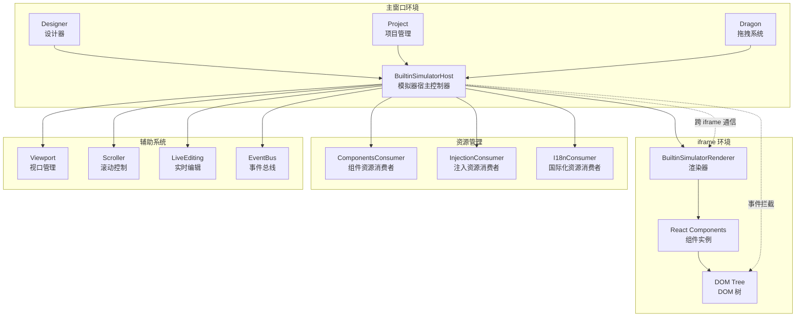
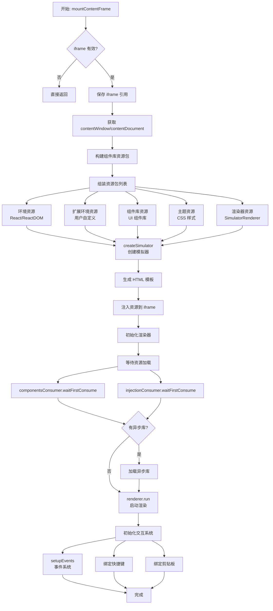
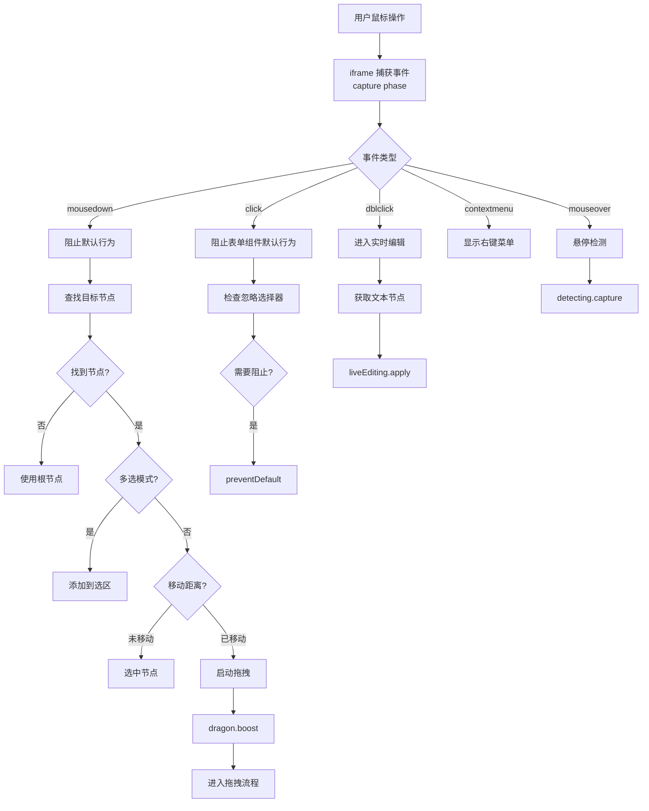
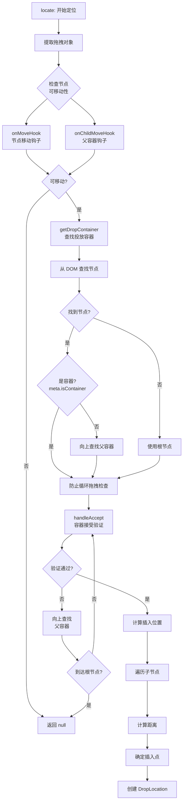
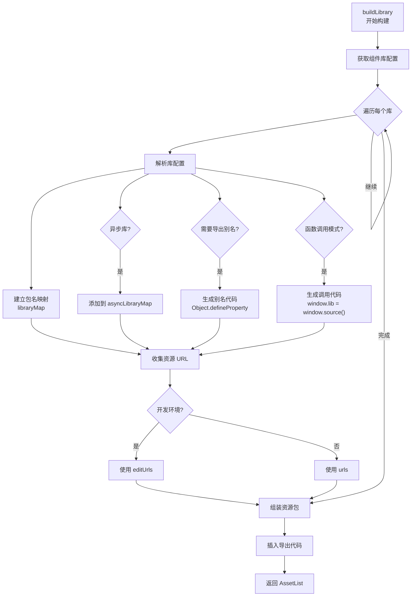
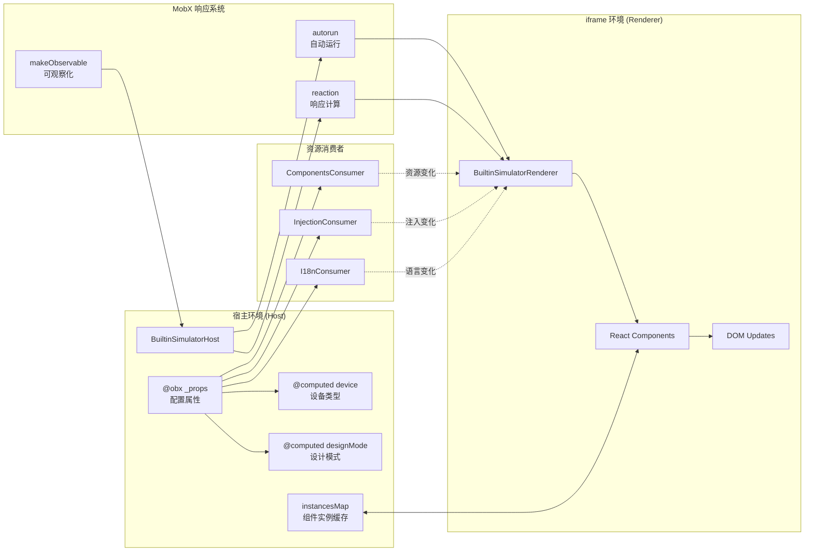
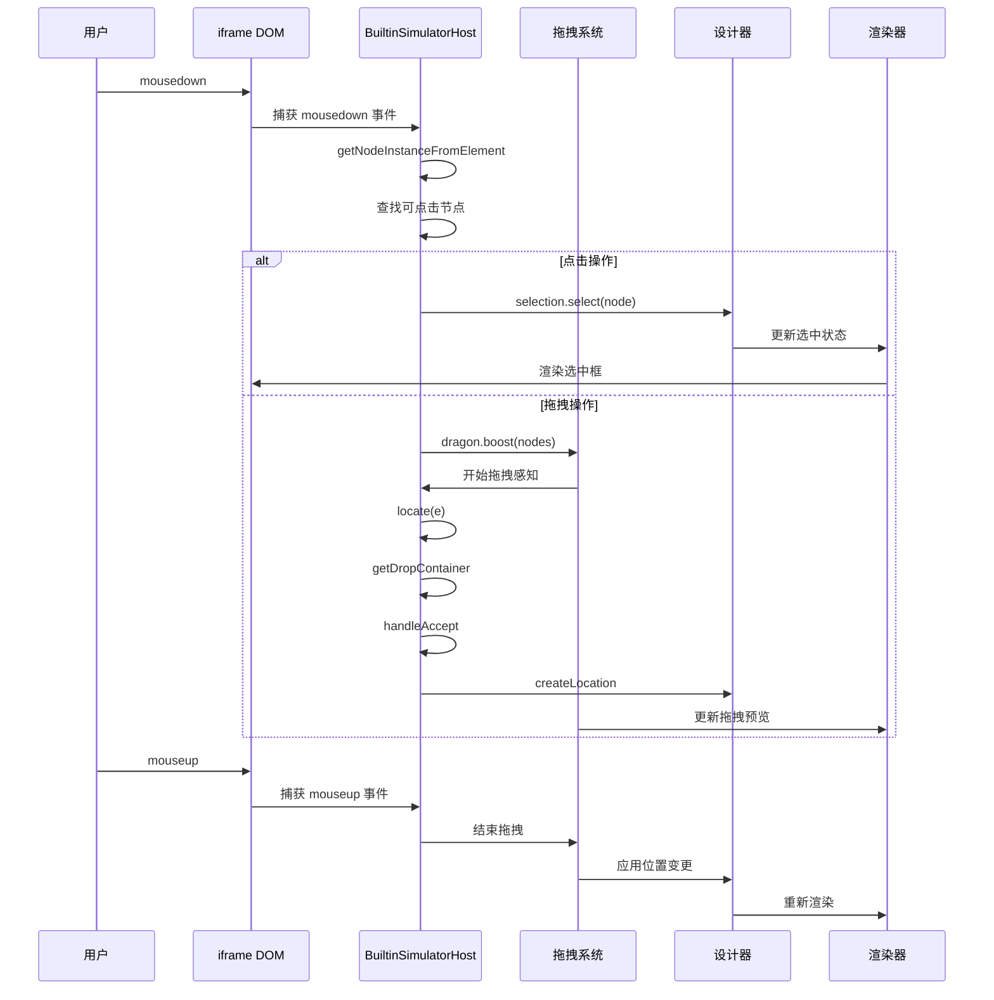

# BuiltinSimulatorHost 核心控制器详解

## 一、整体架构功能分析

### 1.1 核心职责概述

BuiltinSimulatorHost 是低代码引擎的「设计态渲染控制中心」，它就像一个「导演」，负责协调和管理整个设计器的渲染环境。

### 1.2 主要功能模块

#### 1. iframe 生命周期管理

**功能说明**：创建和管理一个独立的 iframe 环境，用于隔离设计态和运行态的代码。

**实际例子**：

```typescript
// 当用户打开设计器时，BuiltinSimulatorHost 会：
1. 创建一个 iframe 元素
2. 注入 React、ReactDOM 等基础环境
3. 加载组件库资源
4. 启动渲染器

// 具体代码：
await this.mountContentFrame(iframe); // 挂载 iframe
// 内部会执行：
// - 建立 window/document 引用
// - 加载默认环境资源（React等）
// - 创建渲染器实例
// - 绑定事件系统
```

#### 2. 组件库资源管理

**功能说明**：动态加载和管理设计器中使用的组件库。

**实际例子**：

```typescript
// 当项目配置了 Ant Design 组件库时：
const library = [{
  "package": "antd",
  "library": "antd",
  "urls": ["https://cdn.jsdelivr.net/npm/antd@4.24.0/dist/antd.min.js"],
  "editUrls": ["https://cdn.jsdelivr.net/npm/antd@4.24.0/dist/antd.js"] // 开发环境用未压缩版
}];

// BuiltinSimulatorHost 会：
1. 解析组件库配置
2. 建立包名到库名的映射：this.libraryMap["antd"] = "antd"
3. 创建导出别名：window["antd"] = window["antd"]
4. 加载 JS/CSS 资源到 iframe
5. 处理异步加载的组件库
```

#### 3. 设计态事件拦截系统

**功能说明**：拦截 iframe 内的所有鼠标事件，转换为设计器操作。

**实际例子**：

```typescript
// 场景：用户点击画布上的按钮组件
// 正常情况：按钮会触发 onClick 事件
// 设计态下：BuiltinSimulatorHost 拦截了这个点击

doc.addEventListener('mousedown', (e) => {
  // 1. 阻止原生事件
  e.preventDefault();
  e.stopPropagation();

  // 2. 查找对应的设计器节点
  const node = this.getNodeInstanceFromElement(e.target);

  // 3. 转换为选中操作
  selection.select(node.id);

  // 4. 支持拖拽启动
  designer.dragon.boost({ type: 'Node', nodes: [node] });
}, true); // 在捕获阶段监听，优先级高于组件事件
```

#### 4. 拖放定位系统

**功能说明**：计算拖拽组件的精确投放位置。

**实际例子**：

```typescript
// 场景：用户从组件面板拖拽一个按钮到表单中
locate(e: ILocateEvent) {
  // 1. 查找投放容器
  const container = this.getDropContainer(e);
  // 判断流程：
  // - 鼠标位置的 DOM → 对应的节点
  // - 节点是容器？meta.isContainer = true
  // - 不是容器？向上查找父容器
  // - 找到 Form 组件（isContainer = true）

  // 2. 计算插入位置
  // - 遍历容器内的子组件
  // - 计算鼠标到每个子组件的距离
  // - 找到最近的组件和插入位置（before/after）

  // 3. 返回位置数据
  return {
    target: formNode,        // 投放到 Form 容器
    detail: {
      index: 2,             // 插入到第3个位置
      near: {
        node: inputNode,    // 靠近 Input 组件
        pos: 'after'        // 在 Input 后面
      }
    }
  };
}
```

#### 5. 实时编辑功能

**功能说明**：支持双击文本组件进入编辑模式。

**实际例子**：

```typescript
// 场景：用户双击一个文本组件
doc.addEventListener('dblclick', (e) => {
  const node = this.getNodeInstanceFromElement(e.target);

  // 进入实时编辑模式
  this.liveEditing.apply({
    node: textNode,
    rootElement: textElement,
    event: e
  });

  // 效果：
  // 1. 文本变为可编辑状态
  // 2. 显示输入光标
  // 3. 监听输入事件
  // 4. 实时更新节点属性
});
```

#### 6. 视口和滚动管理

**功能说明**：管理画布的缩放、滚动和坐标转换。

**实际例子**：

```typescript
// 场景：拖拽时自动滚动画布
this.scroller.scrolling(e); // 根据鼠标位置自动滚动

// 坐标转换：屏幕坐标 → 画布坐标
const canvasPoint = this.viewport.toLocalPoint({
  clientX: e.globalX,
  clientY: e.globalY
});
```

## 二、重要状态和方法分析

### 2.1 核心状态属性

#### 响应式状态（MobX）

```typescript
// 1. 配置属性
@obx.ref _props: BuiltinSimulatorProps = {};
// 作用：存储所有模拟器配置，如设备类型、主题、组件库等
// 响应式更新会触发渲染器重新配置

// 2. iframe 引用
@obx.ref private _contentWindow?: Window;
@obx.ref private _contentDocument?: Document;
// 作用：保持对 iframe 内部环境的引用，用于事件绑定和 DOM 操作

// 3. 组件实例映射
@obx private instancesMap: {
  [docId: string]: Map<string, IPublicTypeComponentInstance[]>;
} = {};
// 作用：缓存每个节点对应的 React 组件实例，支持快速查找和操作
```

#### 计算属性（自动派生）

```typescript
// 1. 设备类型
@computed get device(): string {
  return this.get('device') || 'default';
}
// 作用：根据配置动态计算当前设备类型，影响画布样式

// 2. 设计模式
@computed get designMode(): 'live' | 'design' | 'preview' {
  return this.get('designMode') || 'design';
}
// 作用：控制交互行为，design 模式拦截所有事件，live 模式允许部分交互

// 3. 组件映射表
@computed get componentsMap() {
  return this.designer.componentsMap;
}
// 作用：获取所有已注册组件的元数据，供渲染器使用
```

#### 资源消费者

```typescript
// 1. 组件资源消费者
readonly componentsConsumer: ResourceConsumer;
// 作用：响应式监听组件资源变化，自动重新加载

// 2. 注入资源消费者
readonly injectionConsumer: ResourceConsumer;
// 作用：管理 appHelper 等全局对象的注入

// 3. 国际化资源消费者
readonly i18nConsumer: ResourceConsumer;
// 作用：处理多语言资源的动态切换
```

### 2.2 核心方法分析

#### 1. mountContentFrame - iframe 挂载核心方法

```typescript
async mountContentFrame(iframe: HTMLIFrameElement | null): Promise<void>
```

**作用**：完整的 iframe 环境初始化流程
**关键步骤**：

- 建立 iframe 引用
- 构建资源包（环境、组件库、主题、渲染器）
- 创建模拟器实例
- 等待资源加载
- 启动渲染器
- 初始化事件系统
- 绑定快捷键和剪贴板

#### 2. buildLibrary - 组件库资源构建

```typescript
buildLibrary(library?: LibraryItem[]): AssetList
```

**作用**：将组件库配置转换为可加载的资源包
**关键处理**：

- 建立包名到库名的映射
- 处理异步加载库
- 创建导出别名代码
- 处理函数调用模式的库

#### 3. locate - 拖放定位核心方法

```typescript
locate(e: ILocateEvent): DropLocation | null
```

**作用**：计算拖拽对象的精确投放位置
**核心逻辑**：

- 验证节点可移动性（onMoveHook）
- 查找合适的投放容器
- 防止循环拖拽
- 计算插入位置和方向

#### 4. getDropContainer - 容器查找方法

```typescript
getDropContainer(e: ILocateEvent): DropContainer | null
```

**作用**：判断拖拽目标是容器还是画布
**判断流程**：

- DOM 元素 → 节点映射
- 检查 meta.isContainer
- 向上查找父容器
- 验证容器接受性

#### 5. setupDragAndClick - 设计态事件拦截

```typescript
setupDragAndClick(): void
```

**作用**：拦截所有鼠标事件，转换为设计器操作
**实现原理**：

- 在捕获阶段监听（优先级高）
- 阻止默认行为
- 转换为选择/拖拽操作

#### 6. computeComponentInstanceRect - 组件矩形计算

```typescript
computeComponentInstanceRect(instance: ComponentInstance, selector?: string): Rect | null
```

**作用**：计算组件在画布上的精确位置和尺寸
**用途**：

- 拖放位置计算
- 选中框显示
- 自动滚动判断

## 三、关键设计模式

### 3.1 观察者模式（MobX）

- 使用 @obx 装饰器实现响应式状态
- 使用 @computed 实现自动派生
- 通过 autorun/reaction 实现跨 iframe 同步

### 3.2 资源消费者模式

- ResourceConsumer 封装资源监听逻辑
- 支持异步资源加载和等待
- 自动触发资源更新

### 3.3 事件代理模式

- 在 iframe 父级拦截所有事件
- 统一处理后分发到具体处理器
- 实现设计态和运行态的隔离

### 3.4 策略模式

- 不同设计模式下的事件处理策略
- 不同设备类型的样式策略
- 组件接受性验证策略

## 四、性能优化设计

1. **防抖渲染**：批量操作时防止频繁渲染
2. **事务管理**：批量更新时暂停自动重绘
3. **懒加载**：异步组件库按需加载
4. **缓存机制**：组件实例映射缓存
5. **坐标转换优化**：避免重复计算

## 五、扩展性设计

1. **插件化事件系统**：通过 EventBus 支持扩展
2. **自定义组件元数据**：支持 onMoveHook 等钩子
3. **设备映射器**：支持自定义设备类型转换
4. **主题系统**：支持动态主题切换
5. **国际化**：支持多语言动态切换

## 六、架构设计流程图

### 6.1 整体架构图



### 6.2 iframe 初始化流程图



### 6.3 设计态事件处理流程图



### 6.4 拖放定位判断流程图



### 6.5 组件库资源加载流程图



### 6.6 响应式数据流图



### 6.7 拖拽事件时序图



## 七、核心设计思想总结

### 7.1 隔离设计

- **iframe 隔离**：设计态和运行态代码完全隔离，避免相互影响
- **事件隔离**：通过捕获阶段拦截，实现设计态事件和业务事件的隔离
- **环境隔离**：独立的 window/document 环境，支持不同版本的依赖

### 7.2 响应式设计

- **MobX 驱动**：状态变化自动触发 UI 更新
- **跨 iframe 同步**：通过 autorun/reaction 实现状态同步
- **资源消费者**：响应式监听资源变化并自动更新

### 7.3 可扩展设计

- **插件化事件**：EventBus 支持外部扩展
- **钩子机制**：onMoveHook、onChildMoveHook 等支持自定义行为
- **策略模式**：不同模式、设备下的行为可配置

### 7.4 性能优化

- **批量更新**：事务管理避免频繁渲染
- **防抖处理**：避免高频操作导致的性能问题
- **懒加载**：异步组件库按需加载
- **缓存机制**：组件实例缓存避免重复查找
