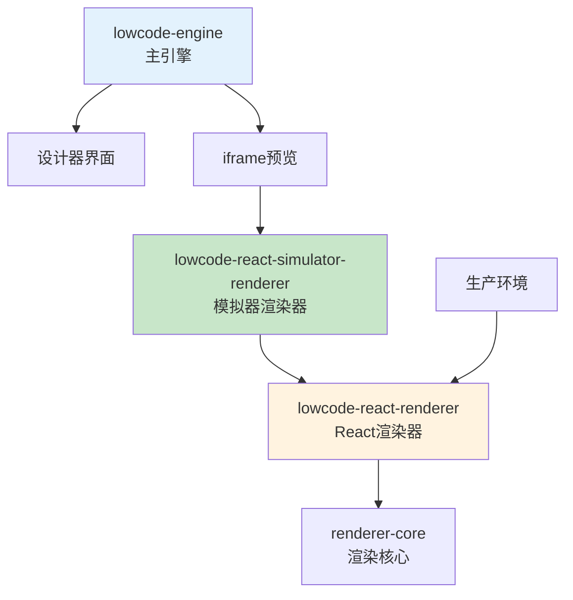

# 低代码引擎构建产物分析

## 1. 构建产物概述

您的判断是**正确的**。低代码引擎确实只有三个主要的构建产物（UMD 格式）：

1. **主引擎包** - `@alilc/lowcode-engine`
2. **React渲染器** - `@alilc/lowcode-react-renderer`
3. **React模拟器渲染器** - `@alilc/lowcode-react-simulator-renderer`

## 2. 主引擎包 (@alilc/lowcode-engine)

### 2.1 包含的 packages 模块

```typescript
// engine-core.ts 中导入的内部模块
import { ... } from '../../editor-core/src';        // 编辑器核心
import { ... } from '../../designer/src';           // 设计器
import { ... } from '../../editor-skeleton/src';    // 编辑器骨架
import { ... } from '../../workspace/src';          // 工作空间
import { ... } from '../../shell/src';              // API Shell层
import { ... } from '../../utils/src';              // 工具函数
```

**具体包含的packages：**
- `packages/editor-core` - 编辑器核心（IoC容器、事件系统）
- `packages/designer` - 设计器核心（拖拽、选择、检测等）
- `packages/editor-skeleton` - UI骨架（布局系统）
- `packages/workspace` - 工作空间（多窗口支持）
- `packages/shell` - API外壳层（对外API）
- `packages/utils` - 工具函数
- `packages/types` - 类型定义
- `packages/plugin-command` - 命令插件
- `packages/plugin-designer` - 设计器插件
- `packages/plugin-outline-pane` - 大纲面板插件

### 2.2 主要功能

- **编辑器环境**：提供完整的低代码编辑环境
- **组件设计**：拖拽、选择、属性编辑等设计功能
- **插件系统**：可扩展的插件架构
- **多窗口支持**：工作空间模式
- **API 接口**：对外暴露的完整API

## 3. React渲染器 (@alilc/lowcode-react-renderer)

### 3.1 包含的 packages 模块

```typescript
// react-renderer/src/index.ts 中导入
import { ... } from '../../renderer-core/src';  // 渲染器核心
```

**具体包含的packages：**
- `packages/renderer-core` - 渲染器核心逻辑

### 3.2 主要功能

- **Schema渲染**：将低代码Schema转换为React组件
- **生产环境渲染**：用于最终页面的渲染
- **React适配**：为React框架提供专用的渲染器
- **组件工厂**：提供各种类型的渲染器工厂

### 3.3 渲染器类型

```typescript
adapter.setRenderers({
    PageRenderer: pageRendererFactory(),        // 页面渲染器
    ComponentRenderer: componentRendererFactory(), // 组件渲染器
    BlockRenderer: blockRendererFactory(),      // 区块渲染器
    AddonRenderer: addonRendererFactory(),      // 插件渲染器
    TempRenderer: tempRendererFactory(),        // 临时渲染器
    DivRenderer: blockRendererFactory(),        // Div渲染器
});
```

## 4. React模拟器渲染器 (@alilc/lowcode-react-simulator-renderer)

### 4.1 包含的 packages 模块

```typescript
// react-simulator-renderer 的依赖
import { ... } from '@alilc/lowcode-designer';        // 设计器
import { ... } from '@alilc/lowcode-react-renderer';  // React渲染器
import { ... } from '@alilc/lowcode-types';           // 类型定义
import { ... } from '@alilc/lowcode-utils';           // 工具函数
```

**具体包含的packages：**
- 自身的渲染逻辑
- 依赖 `react-renderer` 进行实际渲染
- 依赖 `designer` 获取设计器数据
- 依赖 `utils` 和 `types`

### 4.2 主要功能

- **编辑态渲染**：在设计器中实时渲染页面预览
- **iframe渲染**：在隔离的iframe环境中渲染
- **设计器交互**：支持拖拽、选择等设计器操作
- **实时预览**：Schema变化时实时更新渲染结果

## 5. 三个包的功能区别

### 5.1 使用场景对比

| 包名 | 使用场景 | 运行环境 | 主要功能 |
|------|----------|----------|----------|
| `@alilc/lowcode-engine` | 搭建时 | 设计器环境 | 提供完整的可视化编辑能力 |
| `@alilc/lowcode-react-renderer` | 生产时 | 最终用户环境 | 渲染已搭建完成的页面 |
| `@alilc/lowcode-react-simulator-renderer` | 搭建时 | iframe预览环境 | 在设计器中实时预览效果 |

### 5.2 依赖关系



### 5.3 详细功能对比

#### 主引擎包 (lowcode-engine)
```typescript
// 典型使用方式
import { init, plugins, project } from '@alilc/lowcode-engine';

// 初始化设计器
await init(document.getElementById('lce-container'), {
  // 编辑器配置
});

// 注册组件
await plugins.register(componentPlugin);

// 获取Schema
const schema = project.exportSchema();
```

#### React渲染器 (react-renderer)
```typescript
// 生产环境使用
import ReactRenderer from '@alilc/lowcode-react-renderer';

// 渲染页面
<ReactRenderer
  schema={pageSchema}
  components={components}
  appHelper={appHelper}
/>
```

#### React模拟器渲染器 (react-simulator-renderer)
```typescript
// 在iframe中自动使用，通常不需要直接调用
// 由设计器自动加载到iframe中进行预览渲染
window.SimulatorRenderer.render(documentInstance);
```

## 6. 构建脚本分析

### 6.1 UMD构建命令

```json
// 只有这三个包有 build:umd 脚本
{
  "packages/engine": "npm run build:umd",
  "packages/react-renderer": "npm run build:umd",
  "packages/react-simulator-renderer": "npm run build:umd"
}
```

### 6.2 其他packages的作用

其他packages（如editor-core、designer等）主要作为：
- **内部模块**：被主引擎包聚合
- **开发时依赖**：提供源码级的模块化开发
- **独立发布**：支持用户按需引入特定功能

## 7. 总结

1. **三个构建产物正确**：确实只有这三个UMD构建产物
2. **主引擎是聚合包**：包含了大部分内部packages的功能
3. **渲染器分工明确**：
   - `react-renderer`：生产环境渲染
   - `react-simulator-renderer`：设计时预览渲染
4. **模块化设计**：内部按功能拆分为多个packages，外部提供三个主要产物

这种设计既保证了**开发时的模块化**（便于维护和开发），又保证了**使用时的简洁性**（只需要三个主要包）。
