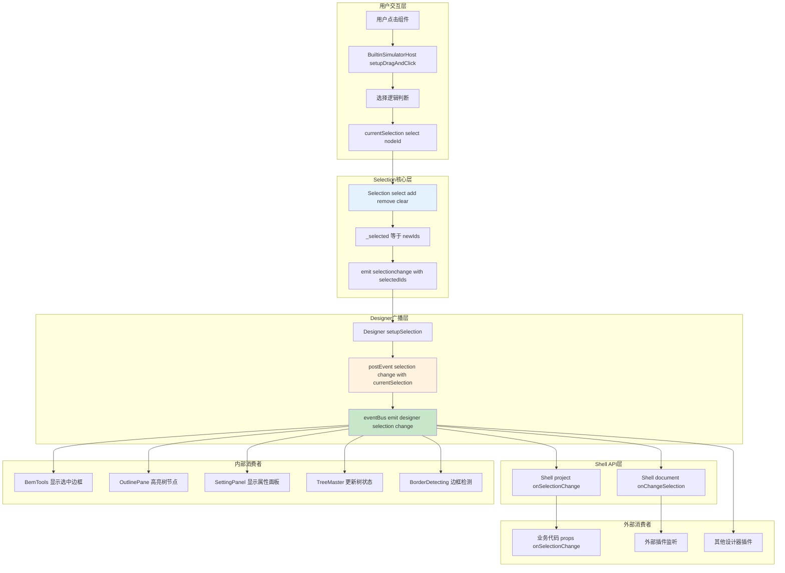

# 低代码引擎选择事件完整流转分析

## 1. 选择事件流转概述

基于 `engine-core.js` 源码分析，低代码引擎的选择事件流转是一个多层级的事件传播系统，从底层的 Selection 模块开始，经过 Designer 层的事件转发，最终到达各个消费模块。

## 2. 选择事件流转完整流程图



## 3. 核心事件触发源码分析

### 3.1 Selection 核心触发

```typescript
// Selection 类的核心方法（engine-core.js 行 30718-30723）
select(id) {
    var node = this.doc.getNode(id);
    if (!(node?.canSelect())) {
        return;
    }
    this._selected = [id];
    this.emitter.emit('selectionchange', this._selected);  // 核心事件触发
}

// 其他选择方法也都会触发相同事件
selectAll(ids) {
    // ... 逻辑处理
    this._selected = selectIds;
    this.emitter.emit('selectionchange', this._selected);
}

clear() {
    if (this._selected.length < 1) return;
    this._selected = [];
    this.emitter.emit('selectionchange', this._selected);
}
```

### 3.2 Designer 事件转发

```typescript
// Designer.setupSelection 方法（engine-core.js 行 40384-40386）
setupSelection() {
    // 监听 Selection 的原始事件
    this.selectionDispose = currentSelection.onSelectionChange(() => {
        // 转发为 Designer 层级事件
        this.postEvent('selection.change', currentSelection);
    });

    // 立即触发一次当前状态
    this.postEvent('selection.change', currentSelection);
}

// postEvent 方法会进一步触发
postEvent(type, data) {
    // 转换为全局事件总线事件
    this.editor.eventBus.emit(`designer.${type}`, data);
}
```

## 4. 各个消费模块的响应行为

### 4.1 BemTools - 选中边框显示

```typescript
// BorderSelecting 组件监听选择变化（推测逻辑）
componentDidMount() {
    this.editor.eventBus.on('designer.selection.change', (selection) => {
        this.updateBorderDisplay(selection.getNodes());
    });
}

// 效果：在选中的组件周围显示蓝色选中边框
updateBorderDisplay(nodes) {
    // 清除之前的边框
    this.clearBorders();

    // 为每个选中节点添加边框
    nodes.forEach(node => {
        const rect = node.getRect();
        this.showBorder(rect, 'selected');
    });
}
```

### 4.2 OutlinePane - 大纲树高亮

```typescript
// TreeMaster 监听选择变化（engine-core.js 行 60272-60282）
project.onChangeDocument(function(document) {
    if (!document) return;

    var selection = document.selection;
    selection?.onSelectionChange(function() {
        var selectedNodes = selection?.getNodes();
        if (!selectedNodes || selectedNodes.length === 0) return;

        var tree = treeMaster.currentTree;
        // 更新树节点的选中状态
        tree.updateSelection(selectedNodes);
    });
});

// 效果：在大纲面板中高亮对应的树节点
```

### 4.3 SettingPanel - 属性面板更新

```typescript
// SettingPanel 监听选择变化（engine-core.js 行 50826-50829）
this.editor.eventBus.on('designer.selection.change', setupSelection);

var setupSelection = (selection) => {
    if (selection && selection.getNodes().length > 0) {
        // 显示选中节点的属性设置面板
        this.setup(selection.getNodes());
    } else {
        // 清空属性面板
        this.setup([]);
    }
};

// 效果：右侧属性面板显示选中组件的属性配置界面
```

### 4.4 BuiltinSimulator - 模拟器事件

```typescript
// 模拟器中的选择事件广播（engine-core.js 行 34743-34745）
editor?.eventBus.emit('designer.builtinSimulator.select', {
    selected: selected  // 组件标识信息
});

// 效果：通知模拟器内部选择状态变化，用于各种内部处理
```

## 5. 事件监听接口汇总

### 5.1 内部监听接口

| 监听位置  | 事件名称                      | 触发时机              | 数据格式                      |
| --------- | ----------------------------- | --------------------- | ----------------------------- |
| Selection | `selectionchange`           | Selection内部状态变化 | `string[]` - 选中节点ID数组 |
| Designer  | `selection.change`          | Designer转发事件      | `Selection` - 选择器实例    |
| EventBus  | `designer.selection.change` | 全局事件总线          | `Selection` - 选择器实例    |

### 5.2 Shell API监听接口

```typescript
// 项目级别监听
project.onSelectionChange((ids: string[]) => {
    // 处理选择变化
});

// 文档级别监听
document.onChangeSelection((ids: string[]) => {
    // 处理选择变化
});

// Selection实例直接监听
selection.onSelectionChange((ids: string[]) => {
    // 处理选择变化
});
```

## 6. 选择事件的特殊处理

### 6.1 多选逻辑

```typescript
// 支持多选的场景（Ctrl+Click）
if (e.ctrlKey || e.metaKey) {
    if (currentSelection.has(nodeId)) {
        currentSelection.remove(nodeId);  // 取消选择
    } else {
        currentSelection.add(nodeId);     // 添加选择
    }
} else {
    currentSelection.select(nodeId);      // 单选
}
```

### 6.2 选择验证

```typescript
// 节点选择前的验证（engine-core.js 行 30719-30721）
select(id) {
    var node = this.doc.getNode(id);
    if (!(node?.canSelect())) {
        return;  // 不可选择的节点直接返回
    }
    // ... 执行选择逻辑
}
```

### 6.3 选择整理

```typescript
// 定期清理无效选择（engine-core.js 行 30764-30770）
tidy() {
    var l = this._selected.length;
    for (var i = this._selected.length - 1; i >= 0; i--) {
        var id = this._selected[i];
        if (!this.doc.hasNode(id)) {
            this._selected.splice(i, 1);  // 移除已删除的节点
        }
    }
    if (this._selected.length !== l) {
        this.emitter.emit('selectionchange', this._selected);  // 触发更新
    }
}
```

## 7. 性能优化机制

### 7.1 事件防抖

- Selection 内部使用 MobX 的响应式机制，避免不必要的重复触发
- 相同选择状态不会重复触发事件

### 7.2 批量操作

```typescript
// 批量选择时只触发一次事件
selectAll(ids) {
    // 一次性设置所有选择
    this._selected = validIds;
    // 只触发一次事件
    this.emitter.emit('selectionchange', this._selected);
}
```

## 8. 调试和监控

### 8.1 事件调试

```typescript
// 开发环境可以监听所有选择事件
if (process.env.NODE_ENV === 'development') {
    selection.onSelectionChange((ids) => {
        console.log('[Selection] Changed:', ids);
    });
}
```

### 8.2 性能监控

```typescript
// 监控选择事件的处理时间
const startTime = performance.now();
selection.select(nodeId);
console.log('Selection time:', performance.now() - startTime);
```

## 9. 总结

低代码引擎的选择事件系统设计精巧，具有以下特点：

1. **分层架构**：Selection → Designer → EventBus → Consumers
2. **事件统一**：所有选择变化都通过 `selectionchange` 事件触发
3. **多重广播**：一次选择触发多个层级的事件传播
4. **功能解耦**：各个消费模块独立监听，互不影响
5. **性能优化**：使用响应式机制和批量操作避免性能问题

这种设计保证了选择状态在整个设计器中的一致性，同时为各个功能模块提供了灵活的扩展接口。
