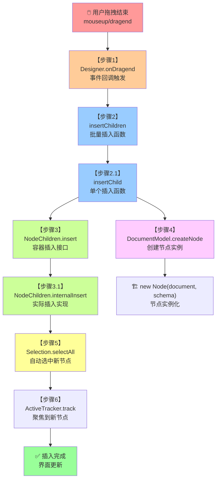

# 组件库拖拽数据插入完整调用链路分析

## 🎯 **概述**

本文档详细梳理了从组件库拖拽组件到数据成功插入文档的完整调用链路，包括每个函数的调用条件、参数传递、执行效果等详细信息。

---

## 🔗 **完整调用链路**



---

## 📋 **详细调用分析**

### **【步骤1】Designer.onDragend - 拖拽结束事件处理**

**📁 文件：** `packages/designer/src/designer/designer.ts`

**🎯 调用条件：**

- 用户完成拖拽操作（mouseup 或 HTML5 dragend）
- Dragon 引擎触发 `dragend` 事件

**📥 输入参数：**

```typescript
interface DragEndEvent {
  dragObject: IPublicModelDragObject;  // 拖拽对象（包含节点或数据）
  copy: boolean;                       // 是否复制模式
}
```

**🔍 关键判断逻辑：**
```typescript
// 1. 检查是否有有效的放置位置
if (loc && isLocationChildrenDetail(loc.detail) && loc.detail.valid !== false) {

  // 2. 判断拖拽对象类型
  if (isDragNodeObject(dragObject)) {
    // 情况A：拖拽现有节点（画布内移动）
    nodes = insertChildren(loc.target, [...dragObject.nodes], loc.detail.index, copy);
  }
  else if (isDragNodeDataObject(dragObject)) {
    // 情况B：🔥 组件库拖拽（新增组件）
    const nodeData = Array.isArray(dragObject.data) ? dragObject.data : [dragObject.data];
    nodes = insertChildren(loc.target, nodeData, loc.detail.index);
  }
}
```

**💡 效果：**
- 根据拖拽类型调用相应的插入逻辑
- 组件库拖拽走 `isDragNodeDataObject` 分支

---

### **【步骤2】insertChildren - 批量插入函数**

**📁 文件：** `packages/designer/src/document/node/node.ts`

**🎯 调用条件：**
- Designer.onDragend 确认有效放置位置后调用

**📥 输入参数：**

```typescript
insertChildren(
  container: INode,                        // 目标父容器节点
  nodes: INode[] | IPublicTypeNodeData[],  // 要插入的节点数组或Schema数组
  at?: number | null,                      // 起始插入位置
  copy?: boolean                           // 是否复制模式（组件库拖拽为undefined）
): INode[]
```

**🔄 处理逻辑：**

```typescript
while ((node = nodes.pop())) {
  // 逐个调用 insertChild 处理每个节点/数据
  node = insertChild(container, node, index, copy);
  results.push(node);
  index = node.index; // 更新下一个插入位置
}
```

**💡 效果：**
- 确保多个节点按正确顺序插入
- 返回成功插入的节点实例数组

---

### **【步骤2.1】insertChild - 单个插入函数**

**📁 文件：** `packages/designer/src/document/node/node.ts`

**🎯 调用条件：**
- insertChildren 逐个处理节点时调用

**📥 输入参数：**

```typescript
insertChild(
  container: INode,                    // 目标父容器
  thing: INode | IPublicTypeNodeData,  // 现有节点或Schema数据
  at?: number | null,                  // 插入位置
  copy?: boolean                       // 复制标记
): INode | null
```

**🔍 类型判断逻辑：**
```typescript
if (isNode<INode>(thing) && (copy || thing.isSlot())) {
  // 情况1：现有节点需要复制
  nodeSchema = thing.export(IPublicEnumTransformStage.Clone);
  node = container.document?.createNode(nodeSchema);
}
else if (isNode<INode>(thing)) {
  // 情况2：现有节点直接移动
  node = thing;
}
else if (isNodeSchema(thing)) {
  // 情况3：🔥 组件库数据，需要创建新节点
  node = container.document?.createNode(thing);
}
```

**💡 效果：**
- 组件库拖拽走情况3：调用 createNode 创建新实例
- 然后调用 container.children?.insert(node, at)

---

### **【步骤3】NodeChildren.insert - 容器插入接口**

**📁 文件：** `packages/designer/src/document/node/node-children.ts`

**🎯 调用条件：**
- insertChild 获得有效节点实例后调用

**📥 输入参数：**

```typescript
insert(node: INode, at?: number | null): void
```

**🔄 处理逻辑：**

```typescript
// 直接调用内部实现，启用变更器
this.internalInsert(node, at, true);
```

**💡 效果：**
- 统一的插入接口，启用历史记录功能

---

### **【步骤3.1】NodeChildren.internalInsert - 实际插入实现**

**📁 文件：** `packages/designer/src/document/node/node-children.ts`

**🎯 调用条件：**
- insert 方法调用，执行实际的节点插入操作

**📥 输入参数：**

```typescript
internalInsert(node: INode, at?: number | null, useMutator = true): void
```

**🔍 关键逻辑：**
```typescript
// 1. 位置计算
let index = at == null || at === -1 ? children.length : at;

// 2. 检查节点是否已存在
const i = children.map(d => d.id).indexOf(node.id);

// 3. 处理原有父容器关系
if (node.parent) {
  editor?.eventBus.emit('node.remove.topLevel', { node, index: node.index });
}

// 4. 执行实际插入
if (i < 0) {
  children.splice(index, 0, node);  // 新增
  node.internalSetParent(this.owner, useMutator);
} else {
  // 位置移动逻辑...
}
```

**🔔 事件触发：**
```typescript
this.emitter.emit('change', { type: 'insert', node });
this.emitter.emit('insert', node);
editor?.eventBus.emit('node.add', { node });
```

**💡 效果：**
- 节点真正插入到DOM树结构中
- 建立正确的父子关系
- 触发各种变化事件

---

### **【步骤4】DocumentModel.createNode - 创建节点实例**

**📁 文件：** `packages/designer/src/document/document-model.ts`

**🎯 调用条件：**
- insertChild 处理 Schema 数据时调用

**📥 输入参数：**

```typescript
createNode<T extends INode>(data: NodeSchema): T
```

**🔍 处理逻辑：**

```typescript
// 1. Schema 标准化
if (isDOMText(data) || isJSExpression(data)) {
  schema = { componentName: 'Leaf', children: data };
} else {
  schema = data;  // 🔥 组件库数据走这里
}

// 2. ID 冲突检查
if (this.hasNode(schema?.id)) {
  schema.id = null;  // 清除冲突ID，让系统自动生成
}

// 3. 创建节点实例
node = new Node(this, schema);
```

**📝 节点注册：**
```typescript
this._nodesMap.set(node.id, node);  // ID映射表
this.nodes.add(node);                // 节点集合
this.emitter.emit('nodecreate', node);  // 创建事件
```

**💡 效果：**
- Schema 数据转换为 Node 实例
- 节点注册到文档管理系统
- 触发节点创建事件

---

### **【步骤5】Selection.selectAll - 自动选中新节点**

**📁 文件：** `packages/designer/src/document/selection.ts`

**🎯 调用条件：**
- Designer.onDragend 插入成功后调用

**📥 输入参数：**

```typescript
selectAll(ids: string[]): void  // 新插入节点的ID数组
```

**🔍 处理逻辑：**

```typescript
ids.forEach(id => {
  const node = this.doc.getNode(id);
  if (node?.canSelect()) {  // 检查是否可选中
    selectIds.push(id);
  }
});

this._selected = selectIds;
this.emitter.emit('selectionchange', this._selected);
```

**💡 效果：**
- 自动选中新插入的节点
- 触发选中变化事件，更新UI状态

---

### **【步骤6】ActiveTracker.track - 聚焦到新节点**

**🎯 调用条件：**
- Designer.onDragend 选中后延迟10ms调用

**💡 效果：**
- 滚动到新节点可视区域
- 确保用户能看到新插入的节点

---

## 🎨 **关键数据流转**

### **组件库拖拽数据流：**

```mermaid
NodeData(Schema) → insertChildren → insertChild → createNode → Node实例 → internalInsert → 插入完成
     ↓               ↓                ↓              ↓              ↓              ↓
组件库数据      批量处理         类型判断      实例化         节点对象      DOM树插入
```

### **参数传递链：**

```javascript
dragObject.data → nodeData → thing → schema → new Node() → node → children数组
```

---

## ⚡ **性能优化点**

1. **批量插入优化：** 使用 `while + pop()` 确保插入顺序
2. **事件延迟：** `setTimeout(() => track(node), 10)` 避免阻塞
3. **ID冲突处理：** 自动重新生成冲突ID
4. **选中过滤：** 只选中 `canSelect()` 的节点

---

## 🐛 **常见问题排查**

### **1. 节点插入失败**
- 检查 `loc.detail.valid` 是否为 `false`
- 确认 `isNodeSchema(thing)` 判断是否正确
- 验证容器节点是否支持子节点

### **2. 选中状态异常**
- 检查节点的 `canSelect()` 方法返回值
- 确认 `selectionchange` 事件是否正确触发
- 验证节点ID是否正确生成

### **3. 历史记录问题**
- 确认 `useMutator` 参数为 `true`
- 检查 `reportModified` 是否被调用
- 验证变更器功能是否正常启用

---

## 📚 **相关文件清单**

| 文件路径 | 主要职责 | 关键方法 |
|---------|---------|---------|
| `packages/designer/src/designer/designer.ts` | 拖拽事件处理 | `onDragend` |
| `packages/designer/src/document/node/node.ts` | 节点插入逻辑 | `insertChildren`, `insertChild` |
| `packages/designer/src/document/node/node-children.ts` | 子节点管理 | `insert`, `internalInsert` |
| `packages/designer/src/document/document-model.ts` | 节点创建管理 | `createNode` |
| `packages/designer/src/document/selection.ts` | 选中状态管理 | `selectAll` |

---

## ✅ **总结**

组件库拖拽数据插入是一个复杂的多步骤过程，涉及：

1. **事件驱动**：拖拽引擎触发 `dragend` 事件
2. **类型判断**：区分节点对象和数据对象
3. **数据转换**：Schema → Node 实例
4. **结构插入**：建立正确的父子关系
5. **状态同步**：选中状态和界面更新
6. **用户体验**：自动聚焦到新节点

整个流程设计精巧，既保证了数据的正确性，又提供了良好的用户体验。
